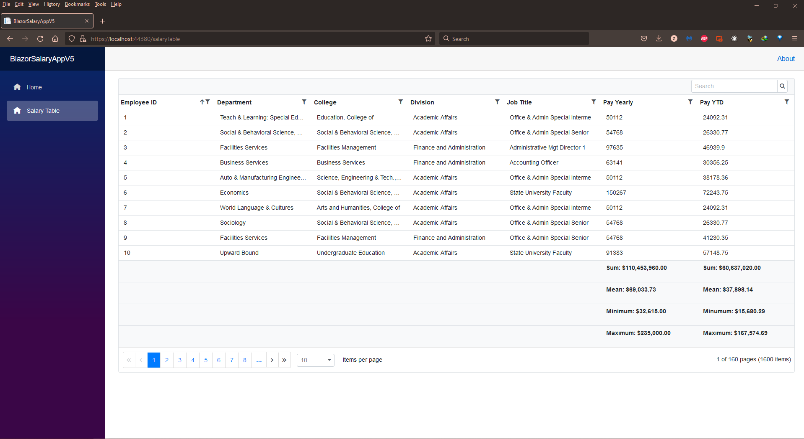

# BlazorSalaryAppV5
Salary web application using ASP.NET Blazor framework 
The application allows the user to interact with a salary dataset.
The data is displayed on a grid table with the ability to sort, search and filter the data. The table also displays calculated values of sum, mean, median, minimum, and maximum updated dynamically. The data is stored in a Microsoft SQL Server database utilizing a REST API for interaction between the database and the client.

Demo:

